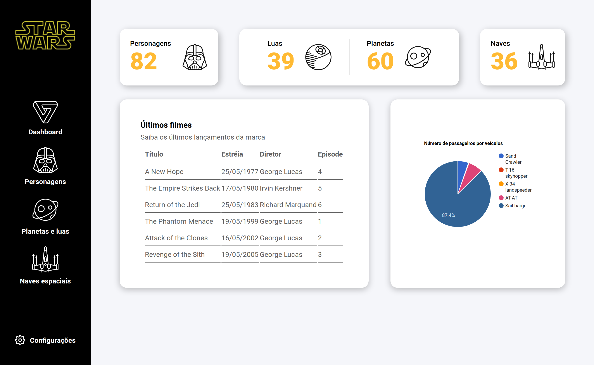

<p align="center">
  

  
  
  <a href="https://github.com/IgorTargino/Dashboard-Star-Wars/commits/master">
    
  </a>
    
   
  
</p>
## 🧐 Sobre o projeto

Uma dashboard de consumo da api do Star Wars (SWAPI) com o intuito de treinar html, css e js.

## 🎨 Layout

### Tela

<div align="center">
  
</div>

---
## Como executar o projeto
### Pré-requisitos
- git 
- Node.js
- NPM ou Yarn

### Instalação
```
# Abra o terminal e copie este repositório com o comando
$ git clone https://github.com/IgorTargino/Dashboard-Star-Wars.git

# Acesse a pasta do projeto no prompt de comando 
$ cd Dashboard-Star-Wars

# Abra o arquivo index.html
$ ./index.html

```
## 🚀 Tecnologias 
Tecnologias utilizadas para desenvolver o projeto:
- HTML
- CSS
- Js
- Axios
- Google Charts

## 🦸‍♂️ **Autor**

<p>
 <sub><strong>🌟 Igor Targino Marinho🌟</strong></sub>
</p>

[](https://www.linkedin.com/in/igor-targino/)
[](mailto:igortargino01@gmail.com)

>Este projeto foi desenvolvido por **[Igor Targino](https://github.com/IgorTargino)**
Se gostou, dá ⭐, vai me ajudar 😉
